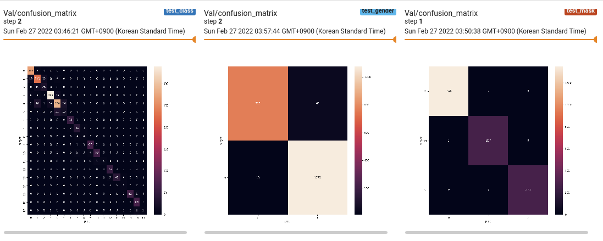

# pstage_01_image_classification

## Getting Started    
### Install Requirements
- `pip install -r requirements.txt`

### Example

config.yaml을 통해 train, inference 설정

🤔 train
```bash
# modify config 
python3 train.py
```
모델 저장 / 학습 결과 로깅 



🤔 inference

모델 디렉토리의 config.yaml의 설정을 불러들여 inference 수행. 결과는 모델 디렉토리에 저장.

```bash
python3 inference.py --model_dir ./runs/exp2
```

### data
#### image 
```bash
data_dir
├── 000001_female_Asian_45 # profiles
│   ├── incorrect_mask.jpg
│   ├── mask1.jpg
│   ├── mask2.jpg
│   ├── mask3.jpg
│   ├── mask4.jpg
│   ├── mask5.jpg
│   └── normal.jpg
├── 000002_female_Asian_52
│   ├── incorrect_mask.jpg
...
```

#### profiles list - text file
```bash
000001_female_Asian_45
000002_female_Asian_52
000004_male_Asian_54
000005_female_Asian_58
000006_female_Asian_59
000007_female_Asian_58
...
```


### config
#### config 항목
* **general**
  * seed (int):
    * random seed
  * data_dir (str):
    * 훈련 데이터 디렉토리 
  * train_profile (str):
    * **학습** 프로필 목록을 가진 텍스트 파일 경로
  * valid_profile (str):
    * **검증** 프로필 목록을 가진 텍스트 파일 경로
  * num_classes (int):
    * **metric 계산을 위한** 클래스 수
    * 18개 클래스 분류: 18, 이진 분류: 2, ... 
  * train_batch_size (int):
    * 학습 배치 사이즈
  * valid_batch_size (int):
    * 검증 배치 사이즈
* **train**
  * epochs (int):
    * 총 학습 epoch 수
  * log_interval (int):
    * 학습 루프에서 로깅 간격 (배치 단위 - 20이면 20배치 학습시마다 metric, loss 평균값 로깅)
* **model save**
  * model_dir (str):
    * 실험(학습)을 저장하는 디렉토리
    * 매 실험마다 `model_dir`에 새로운 디렉토리를 생성함
  * name (str):
    * 실험 이름. `model_dir`에 `name`으로 디렉토리가 생성되고 모델, 텐서보드 로그파일, inference 결과 저장
    * ex) name: exp -> 실험 반복시 exp, exp1, exp2, ... 차례로 생성
  * best_criterion (enum str: f1 | acc | loss)
    * best 모델 저장 기준 metric
* **dataset**
  * dataset (str):
    * 사용할 데이터셋 클래스 이름. `dataset.py`에 정의되어야한다.
    * 정의된 데이터셋:
      1. CustomDatasetSplitByProfile 
  * dataset_args (dict):
    * 데이터셋 keyword arguments
    * **필수 arguments**
      * output (enum str: all | class | mask | gender | age)
        * all: (mask, gender, age) 라벨 출력, ex) (1, 0, 2), ...
        * class: 18개 클래스로 인코딩된 라벨 출력, ex) 0, 7, 17, ...
  * augmentation (str):
    * augmentation에 사용할 transform 이름. `dataset.py`에 정의되어야한다.
  * augmentation_args (dict):
    * transform keyword arguments
* **model**
  * model (str):
    * 사용할 모델 이름. `model.py`에 정의되어야한다.
  * model_args (dict):
    * 모델 생성 keyword arguments
* **loss**
  * criterion (str):
    * 사용할 loss 이름. `loss.py`의 `_criterion_entrypoints`에 추가되어야한다.
  * criterion_args (dict):
    * loss keyword arguments
* **optimizer**
  * optimizer (str):
    * 사용할 optimizer 이름.
    * pytorch 또는 `optim.py`에 정의되어야한다. 
  * lr (float):
    * 학습률
  * weight_decay (float):
    * l2 decay
  * scheduler (str):
    * 사용할 학습률 스케쥴러 이름
    * pytorch 또는 `scheduler.py`에 정의되어야한다.
  * scheduler_args (dict):
    * 스케쥴러 keyword arguments
* **inference**
  * infer_data_dir (str):
    * inference 데이터 디렉토리

#### config example
##### binary classification - gender
```yaml
...
dataset_args: {
  output: gender,
  ...
}
model: 출력이1개인모델
...
criterion: BCELoss
...
```
##### multi class classification - mask
```yaml
...
dataset_args: {
  output: mask,
  ...
}
model: 출력이3개인모델
...
criterion: cross_entropy
...
```
##### multi label classification - (mask, gender, age)
```yaml
...
dataset_args: {
  output: all,
  ...
}
model: 출력이8개인모델
...
criterion: cross_entropy
...
```